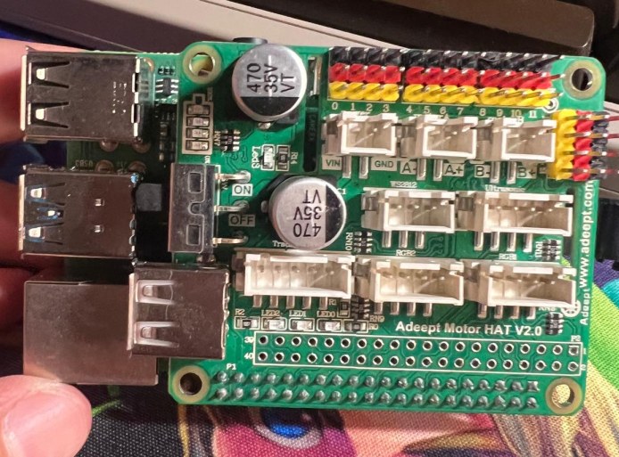
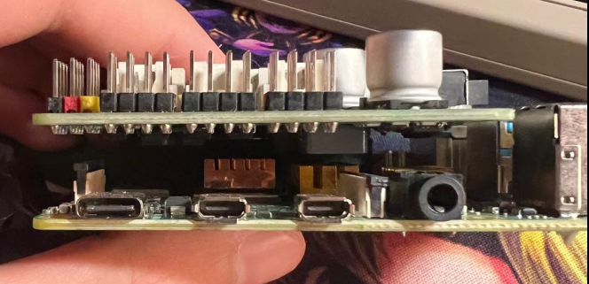
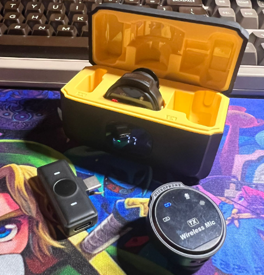
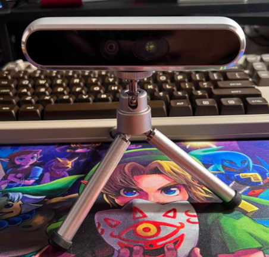
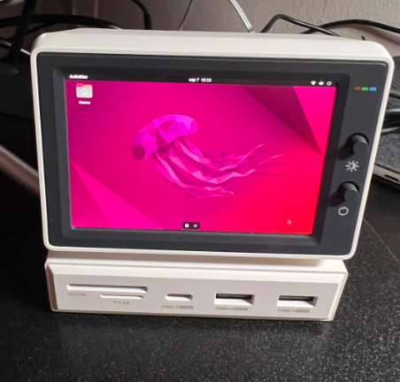

# HeWo Bot
## A personal robot project
After two years of working on a social robotics project, I have decided to conduct an opensource project for
the community to gather basic knowledge on how to design human robot interactions.

This is a repository for a series of implementations of open-source packages. In order to develop a 
minicharacter/assistant called HeWo the robot, HeWo-bot or simply hewo. 

The tools are already out there, we have to use them all.

  

And yes `HeWo` comes from `Hello World`.

## Devices used
- Raspberry Pi 4 with and Adeept Motor HAT (from rasptank robot). The HAT makes it easier to control stuff.

  
  

- Bluetooth usb c microphones

  

- Camera for computer vision, Intel Realsense D400 series

  

- Display. I am using a mini display resembling an old computer monitor.

  

It also has ports for everything, such as oudio output, usb, usb-type c, hdmi, etc...

## Goals
### Basic
- [x] Face expression setup 
- [ ] Face expression control engine
- [ ] Voice recognition
- [ ] Voice synthesis
- [ ] Voice control engine
- [ ] Computer vision data processing
- [ ] Dialog engine and conversational data processing
- [ ] Audio interface to record/play audio

### Movement
- [ ] Neck design and type of mechanism choice
- [ ] Design of the body of the robot
- [ ] Choice of claws/hands
- [ ] Choice of wheels/legs
